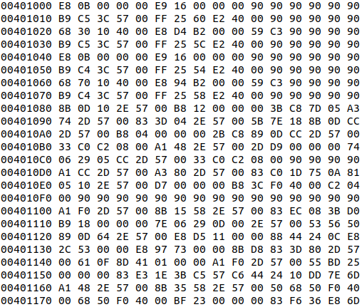
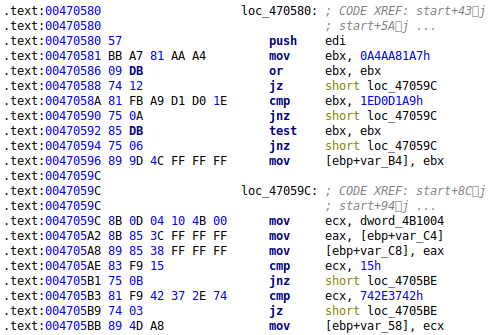

# Summary

Machine Learning for Malware Detection and Classification

``PE Extractor`` is a Python package for the preprocessing, the extraction of features and the visualization of Portable Executable files. 
``PE Extractor`` has been designed to provide a class-based and user-friendly interface for the extraction of well-known
features commonly used for the task of malware detection and classification such as byte and opcode N-Grams, API function calls, 
the frequency of use of the registers, characteristics of the Portable Executable file sections, etcetera [@Ahmadi:2016], [@Zhang:2106]. 
In addition, ``PE Extractor``has various command line tools to visualize the executables as grayscale images [@Nataraj:2011], [@Gibert:2018a]
or as a stream of entropy values (structural entropy) [@Gibert:2018b].

``PE Extractor`` has been designed to be used by both computer security researchers and by students in courses on malware analysis,
machine learning and computer security. Currently, it has already been used in a number of scientific publications [@Gibert:2018a], [@Gibert:2018b], [@Gibert:2021] 

# Statement of Need

``PE Extractor`` is intended for scientists and researchers who would like to conduct research on malware detection. 
``PE Extractor`` facilitates the extraction of well-known features from Portable Executable files that can be used to build
detection systems powered by machine learning. In addition, it provides command-line tools to visualize the executable
as grayscale images or as a stream of entropy values.

# Functionality
``PE Extractor`` requires the user to provide a Portable Executable file in one of the following two formats:

- Hexadecimal representation of its binary content. This representation represents the machine code as a sequence of 
hexadecimal values. The first value indicates the starting address of the machine codes in the memory, and each 
hexadecimal value (byte) carries meaningful information of the Portable Executable file such as instruction codes
and data. There are various tools to obtain the hexadecimal view of a binary file such as [PE Explorer](http://www.heaventools.com/flexhex-hex-editor.htm), [HxD](https://mh-nexus.de/en/hxd/), and so on.

- Assembly language source code. The  assembly language source code contains the symbolic machine code of the executable
 as well as metadata information such as rudimentary function calls, memory allocation and variable information. 
 There are various tools for disassembling Portable Executable files such as [IDA Pro](https://www.hex-rays.com/products/ida/), 
 [Radare2](https://rada.re/n/), [Ghidra](https://ghidra-sre.org/), etcetera.

## Feature Engineering
Currently, ``PE Extractor`` can extract the following features:

- Hexadecimal-based features.
    - Metadata features.
    - Byte 1-Gram features.
    - Entropy features.
    - Haralick features (from the grayscale representation of the hexadecimal view).
    - Local Binary Pattern features (from the grayscale representation of the hexadecimal view).
- Assembly-based features.
    - Metadata features.
    - Opcode 1-Gram features.
    - Register features.
    - Data define directives features.
    - Section characteristics features.
    - Symbol frequency features.
    - Application Programming Interface (API) function calls.
    - Pixel intensity features (from the grayscale representation of the assembly code).
    - Miscellaneous features (keywords).

A complete description of the aforementioned features is provided in [@Gibert:2021]. 

## Visualization Tools
``PE Extractor`` provides various command-line tools to visualize the executables as follows:

- As grayscale images.

- As a stream of entropy values (structural entropy).

These kind of visualizations can be used to group malware into families based on their visual similarity [@Gibert:2018a] [@Gibert:2018b].

# References

